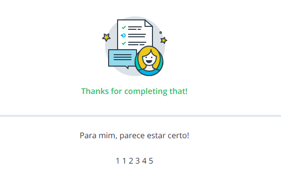

# Intro to Data Structures and Algorithms

So! Yes! Here we are again. We have already learned a little bit about the basics and a little bit more about OOP in Python. But now comes the interesting part... chan chan chaaaaaaaaaaaaannnn and the reason why we are still triggered with the concept of programming: Data Structures and Algorithms.

Once upon a time there was a girl who knew how to play a little bit with code. 4th semester, I guess. Not great expectations in this new subject but suddenly everything changed for her. The magic of creating with simple concepts. Nodes, graphs, connections. Simple functions that created a whole universe of solutions to solve a single problem. The power of simplicity. The power of understanding. The power of programming. A sheet of paper, a pencil and her mind dancing around with ideas that jumped in her head til the eureka moment comes! Yes. Definitely one of the greatest feelings ever. 

This is the beginning of a new journey that tries to return to that state of flow where everything seemed to be challenging but at the same time so exciting that it felt like a constant game and dance. However, as Heraclitus once said: “No man ever steps in the same river twice, for it's not the same river and he's not the same man.”, this is a new beginning to reinvent ourselves. Discover new patterns and experience new sensations. Sensations? Really? Yep... It may sound kinda strange but every time that I learn sth related with creating, specially when it comes to solve problems with creativity, pencil, sheet of paper and my mind, I feel such a river of sensations that I can't stop. 

This is the chapter where we begin to learn again about the way we can create solutions and understand problems. This is the chapter where we begin to learn again about data structures and algorithms.

<p style="text-align:right"><b> "The desire to create is one of the deepest yearnings of the human soul</b>"<br>Elder Uchtdorf</p>


## How are we going to learn?

Contrary to the previous two steps of this journey, (check them out here in case you missed them -> [Step 1: Basics](https://github.com/ariasAleia/Learning_Python) and [Step 2: OOP](https://github.com/ariasAleia/OOP_Python)) we are now going to learn about data structures and algorithms in Python following along a course grown by Google in Udacity: [Intro to DS and Algorithms](https://www.udacity.com/course/data-structures-and-algorithms-in-python--ud513)

First of all, we needed to check if our knowledge of Python is enough to understand the concepts of data structures and algorithms. We did it by implementing a couple of methods of a class. The source code can be found in the file of the class [classy.py](scripts/classy.py)

Proof of that we did it correctly:
<p align="center">

</p>

And then we had to do another small example to know if we were familiar with the way Python handles strings and we did it again :) The solution and the problem statement can be found in [this file](scripts/exercise0.py).

<p align="center">

</p>


## Efficiency and Complexity

Like everything in life, it is all a matter of balance. We must think about algorithms in terms of time and space. How much time does it take us to run the algorithm and get a result? And... How much space do we need? How much memory do we need to process the information til we get a result?

A tradeoff: a balancing of two qualities both of which are desired but that may not have a totally compatible existence.

## Big O notation

Yes... we love coding and most of the time we do it alone with our pencil and sheet of paper, however, we are social beings and the need to communicate the way we are doing things. In this case, we want to be able to communicate how good or bad the behavior of an algorithm is: its complexity. It's also important for us to know how good an algorithm developed by sb else is. That means, we all need a common language and that language in this case is the Big O Notation. 

We will basically describe the complexity of an algorithm depending on the amount of data that we get as input. That amount of data is n.

So we have...
* $O(n)$ We pronounce it as: Big O **of** n
* $O(n^2)$
* $O(log (n))$
* $O(k)$ with $k$ being a constant. That here is great: constant time

We don't necessarily have to check every single calculation that is performed, we can approximate. That means that $O(2n +1)$ would be the same as $O(n)$.

### Let's practice with an example

```python
"""input manatees: a list of "manatees", where one manatee is represented by a dictionary
a single manatee has properties like "name", "age", et cetera
n = the number of elements in "manatees"
m = the number of properties per "manatee" (i.e. the number of keys in a manatee dictionary)"""

def example1(manatees):
    for manatee in manatees:
        print manatee['name']

def example2(manatees):
    print manatees[0]['name']
    print manatees[0]['age']

def example3(manatees):
    for manatee in manatees:
        for manatee_property in manatee:
            print manatee_property, ": ", manatee[manatee_property]

def example4(manatees):
    oldest_manatee = "No manatees here!"
    for manatee1 in manatees:
        for manatee2 in manatees:
            if manatee1['age'] < manatee2['age']:
                oldest_manatee = manatee2['name']
            else:
                oldest_manatee = manatee1['name']
    print oldest_manatee
```

Our answers:

  

The hipermega great result :):

  

## Collections

Well... A collection is basically a group of things. They can be different kind of things and they don't have an order. A collection of friends, of books, of thoughts... or a collection of friends and books.

In Python we have different collections that can have different properties. For example lists, which do have an order.

### Lists

They do have an order. A really famous type of lists are arrays. Arrays have an index for each one of the elements. Some problems that may arise with arrays are related to the high complexity that it takes to delete or add elements to them.

## Linked list

Here we don't have indexes in comparison to an array. We have links. Each element knows who is next but they don't really know where they are. Yes... we don't have as much information as with those indexes but it has some advantages. We can do operations such as delete and add elements in an easier and faster way. That means... A lower complexity :)


In a linked list we store a reference to the next element. In hardware level we are saving the memory location of the next element in the list so that if we need to do an insertion or deletion of an element in the list it's just a matter of moving the references and it occurs in constant time.

There is also sth called **doubly linked list**. Do you have an idea of what this could be? Yes! We don't only save the reference of the next item but also the reference of the previous one!


### Practicing with linked lists

Knowledge is not power. Knowledge is potential power. We gotta do sth with that knowledge to unleash its power and that's exactly why we need to practice.

We just implemented the functions to insert, delete and get the value of an specific node in the linked list. Did you read well? We implemented the functions by ourselves! (See the source code [here](scripts/linked_list.py)) And... it worked! 


<p align="center">

</p>


**Lesson 1:** A node is not the same as the value of the node! Take care Aleja.


**Extra important info:** When we talk in terms of list we use the terms *insert*, when we add an element in a specific position, *append*, when we add an element at the end, *delete*, when we, forgive the redundancy, delete an element. But with stacks it's different, we push or pop.

Keep reading to know more.


## Stacks: L.I.F.O

Yep... Last in, first out. That's it. Got it? Ehmmm... Ok, let's explain a little bit more. Stacks is a type of data structure where we pay attention to the last element we add because every element that we add goes at the end of the list. 

Adding an element is called **push** and removing an element is called **pop**. 


**Really important:** We can only push and pop the last element!

**Extra important info:** When we pop, we also return (usually, almost always) the last element. We don't only delete it but we also return it. 

**Extra extra info:** The first element is called the *head* or the *top*. We push to the top or we pop the top.

### Practicing...

You can find methods to pop and push in this [file](scripts/stack.py)

It's is interesting how easy it is to have access to the head of a list and therefore to implement a stack.

And yep! Feedback:

<p align="center">

</p>


**Lesson 2:** If your function returns a value x but it doesn't do it directly but by calling another function, you still have to use the word return!

```python
def func1(self):
    return self.func2()
```

Hey! Sth important. **If we do the job, we do it properly.** Check line 37 of the [stack file](scripts/stack.py). Actually it would not be strictly necessary to set the value of the next node of the deleted node to None, but... it's better. Because imagine if we return the deleted head and then for any reason we check the next node of that deleted head (that we just deleted) and then we would point to the current new head. That could cause seeerious problems so: If we do sth, we do it clean. 


## Queues... 

Queue, dequeue, enqueue, peek, dequeue and priority queue... Ok. Maaany terms. Let's begin slowly. 

What is a queue? Well.. A queue is a data structure where we add an element at the end of the list. Yep, the opposite to a stack. That means **F.I.F.O: First in, First out**.
The first element is called *Head* and the last element is called *Tail*.

When we **dequeue**, we take the first element that was added and we delete it. We delete the head.

When we **enqueue**, we add an element at the end of the queue. There is now a new tail.

We can also **peek**, that means we look at the value of the head.

There are two famous queues:

* Dequeue: We can enqueue and dequeue.
* **Priority queue:** Each of the elements has a value but also a **priority**. When we dequeue, we delete the element with the highest priority. If all of them have the same priority, then we delete according to F.I.F.O, therefore we would delete the head.


## Practicing: 

Now, let's implement the functions dequeue and enqueue. It's pretty easy if we do it using a python list and the function append (that is like the enqueue) and the function pop (specifying the first element it would be like dequeue). The source code can be found [here](scripts/queue.py).

And again feedback. Yes... I dooo like feedback. Sensor mode on :P


<p align="center">

</p>


# Algorithms

A great word. Is it just me the one who gets excited just by hearing this word? Well... I really like this word. But what does it mean?

An algorithm is a trick to do magic. It's sensational but at the same time so simple that the magic relies on the simplicity. Basic structures with a great mind and you have real magic.

<p style="text-align:right"><b> "It's not the tool. It's what you do with the tool what determines its geniality</b>"<br>Aleia Arias :)</p>

Let's begin with some basic, simple and fascinating algorithms...

## Binary Search

If we could summarize this algorithm in a sentence, we should say: If we organize, everything can be easier.

If we want to find if a number is in an array, we do it checking number by number but that would be of complexity... Guess? Yep! $O(n)$, linear, and that's not so good. We can improve that for sure. How?

Let's begin by ordering the numbers from lowest to highest in a list. Done? Ok... And now let's see take the element of the middle in the list and compare it with our number. Is our number greater or smaller? If it's smaller, we already know that the number must be, if it is, in the first half of the list. On the other hand, if our number is greater, then we have to look in the second half of the list. And then repeat the same! 

Which complexity (or efficiency) would we have now? We divide the list by two, and divide again, and again and again... Do you see the pattern? Yep! $O(log_2(n))$

In Ds when we write log, we already mean $log_2$ so we actually could omit that and just say that the complexity is $O(log(n))$. Waaaay faster than linear complexity.

Beautiful, isn't it? Yes...

I told you: Algorithms :)


### Practicing


Ok, ok. Cute and all but if we just take input and do not generate output then we are not really doing something. So! Here it goes. Our [own implementation](scripts/binary_search.py) of binary search :D

Taraaaaaaaaaaaaaaaan

  

